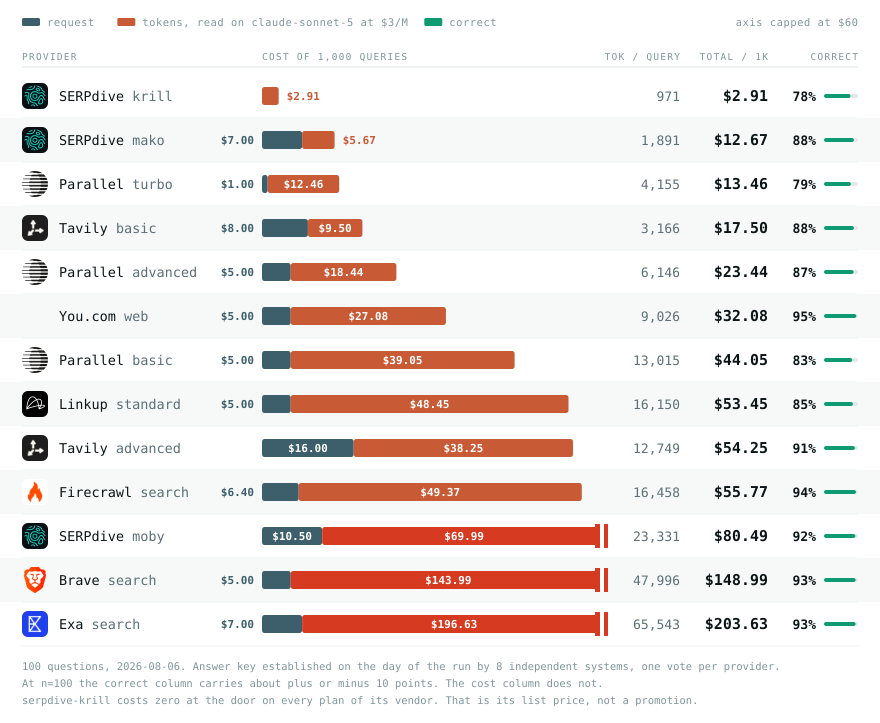

# search-api-cost-benchmark

**What does a correct answer actually cost?**

A search API bills you twice. Once at the door, per request, which is the number on the
pricing page. Then again, per token, when its payload lands in your agent's context
window.

Nobody prints that second invoice, and it is usually the larger of the two. One arm
below advertises **$5 per 1,000 requests** and costs **$149** by the time a model has
read what it sent back.

<picture>
  <source media="(prefers-color-scheme: dark)" srcset="docs/table-dark.svg">
  
</picture>

## Results

100 questions, 2026-08-06, 13 priced configurations, sorted by total cost.
Tokens are counted on `anthropic/claude-sonnet-5` at its $3/MTok list rate.

<!-- RESULTS -->
| # | Provider | API $/1k | Tokens / query | LLM $/1k | **Total $/1k** | Correct | $ / correct answer |
|---:|---|---:|---:|---:|---:|---:|---:|
| 1 | `serpdive-krill` | $0.00 | 971 | $2.91 | **$2.91** | 78% | $0.0037 |
| 2 | `serpdive-mako` | $7.00 | 1,891 | $5.67 | **$12.67** | 88% | $0.0144 |
| 3 | `parallel-turbo` | $1.00 | 4,155 | $12.46 | **$13.46** | 79% | $0.0170 |
| 4 | `tavily-basic` | $8.00 | 3,166 | $9.50 | **$17.50** | 88% | $0.0199 |
| 5 | `parallel-advanced` | $5.00 | 6,146 | $18.44 | **$23.44** | 87% | $0.0269 |
| 6 | `you-web` | $5.00 | 9,026 | $27.08 | **$32.08** | 95% | $0.0338 |
| 7 | `parallel-basic` | $5.00 | 13,015 | $39.05 | **$44.05** | 83% | $0.0531 |
| 8 | `linkup-standard` | $5.00 | 16,150 | $48.45 | **$53.45** | 85% | $0.0629 |
| 9 | `tavily-advanced` | $16.00 | 12,749 | $38.25 | **$54.25** | 91% | $0.0596 |
| 10 | `firecrawl-search` | $6.40 | 16,458 | $49.37 | **$55.77** | 94% | $0.0593 |
| 11 | `serpdive-moby` | $10.50 | 23,331 | $69.99 | **$80.49** | 92% | $0.0875 |
| 12 | `brave-search` | $5.00 | 47,996 | $143.99 | **$148.99** | 93% | $0.1602 |
| 13 | `exa-search` | $7.00 | 65,543 | $196.63 | **$203.63** | 93% | $0.2190 |

`serpdive-krill` costs zero at the door on every plan of its vendor, free or paid. That is its list price, not a promotion, and the token column still applies.
<!-- /RESULTS -->

Every number above is recomputable from `runs/2026-08-06c/`, offline, without a key.

## The answer key is rebuilt on the day of the run

This is the part worth reading before the table.

The questions come from [FreshQA](https://github.com/freshllms/freshqa), a set built
specifically out of questions whose answers move. That property is the whole reason it
is here: a benchmark of settled facts can be tuned against once and stays tuned
forever, so the score has to come from actually going and looking.

But the answers move faster than the file. FreshQA was last republished on 2026-04-21.
By August, on **13 of these 100 questions**, every engine converged on one answer and
the frozen key rejected all of them. The UK prime minister had changed, the NFL season
had turned over, Peru had elected a different president. The payloads carried the
current truth and the benchmark scored them as failures.

That is not a small correction. Graded against the April key, every arm here loses
between **8 and 18 points**, and the arms that lose most are the ones that are most up
to date. A time-sensitive benchmark with a frozen answer key measures how old your
index is, not how good it is.

There is no neutral referee to appeal to, because checking a fresh fact requires a
search engine, which is the thing under test. So the referee is the field itself: every
system answers, and what they converge on is the answer of the day. One vote per
provider, its most advanced configuration, so a vendor selling three tiers does not get
three votes. A question the field cannot settle is dropped and replaced, and the run
loops until the full hundred stand.

The failure modes of that design, including one case in this very run where the field
converged on the wrong answer and a single arm was right, are in
[`METHOD.md`](./METHOD.md) §3.

## Run it yourself

```bash
npm install                 # no dependencies; this just creates node_modules
cp .env.example .env        # your keys, none of ours are in this repo

node bin/probe.mjs                          # one live call per arm: is the key good
node bin/import-freshqa.mjs --n=100         # freeze the question set
node bin/bench.mjs --run=runs/$(date +%F) \
     --voters=brave-search,exa-search,firecrawl-search,linkup-standard,parallel-advanced,serpdive-moby,tavily-advanced,you-web
```

`bench.mjs` is the whole pipeline: collect, build the answer key, replace what the field
could not settle, redraw, count tokens, convert them to the answering model, grade, and
write the table. Every phase resumes, and nothing already on disk is ever paid for
twice.

**Pass `--voters` explicitly.** Without it every arm votes, which gives a vendor selling
three tiers three votes. The list above is one voice per provider, its most advanced
tier.

`--seed` on `import-freshqa.mjs` defaults to the seed the published table was drawn on,
so you land on the same questions and can compare your numbers to these.

Expect about $20 for a full run at n=100, most of it token counting.

## Add your provider

An arm is ten lines in [`lib/providers.mjs`](./lib/providers.mjs):

```js
'your-api': {
  vendor: 'You',
  envKey: 'YOUR_API_KEY',
  docs: 'https://…',
  async call(query, key) {
    return fetch('https://api.example.com/search', {
      method: 'POST',
      headers: { authorization: `Bearer ${key}`, 'content-type': 'application/json' },
      body: JSON.stringify({ query }),
      signal: AbortSignal.timeout(60000),
    });
  },
},
```

Add its price to [`pricing.json`](./pricing.json) with a source URL and a date, then
run. Pull requests welcome, including ones that beat the arms already here. That is
what this is for.

Two rules an arm has to respect. Run the **vendor's documented default**, not a tuned
configuration. And if the vendor sells the same endpoint at two prices, that is **two
arms**, because it is two invoices.

An arm with no price in `pricing.json` is reported **unranked**, never at $0.00.

## What a run leaves behind

```
runs/<date>/
  questions.json    the frozen set: source, version, seed, what the screen dropped,
                    and every question replaced during the loop
  raw/<arm>/…       every payload, verbatim, as it came off the wire
  collect.json      status, wall latency, self-reported latency, billed units, bytes
  readings.json     what each arm's reader said, from one payload, alone
  gold-today.json   the answer of the day per question, with the vote and the reason
  gold-meta.json    who voted, who was read but did not vote, and which models ruled
  tokens.json       billed prompt_tokens per arm, measured not estimated
  reprice.json      the per-arm ratio to the model that answers, measured on real payloads
  scoreboard.json   one grade per arm per question, against both keys
  results.json      the arithmetic
  report.md         the table
```

## Method

[`METHOD.md`](./METHOD.md) covers what is measured and what is refused. The short
version:

- **The answer key is built by the field on the day of the run.** Every arm's reader
  sees one payload, alone, and reports what it says. An arbiter that sees the answers
  but never the payloads decides what they agree on, and is allowed to refuse.
- **One vote per provider**, its most advanced tier. Every arm is still read and still
  scored; only the electorate is capped.
- **Questions the screening model already knows are dropped**, or the score measures
  memory instead of your search API. 33 of 140 screened went that way.
- **Payloads ship verbatim**, minus each vendor's own synthesis, the same rule on both
  sides. We compare the material, not the summarisers.
- **Token counts are the invoice**, `usage.prompt_tokens` from a real call, then
  converted per arm to the answering model by a ratio measured on real payloads.
- **Failures stay in the denominator.** You paid at the door.
- **Prices are list pay-as-you-go**, promotional rates ignored for everyone, including
  the maintainer's own.

## Limits, stated up front

**n=100 does not separate close arms.** The 95% interval on a 90% score is about ±6
points, and about ±10 at 60%. Most of the top of the quality column is not separated by
this run. The cost column carries no such noise.

**The consensus key can be wrong.** It follows what the pages say, and the pages can
agree on something stale or on a misreading. One documented case in this run, disclosed
in METHOD §3, cost the only arm that got it right.

**The ranking is for this question profile**: answers that change. A different profile
gives a different ranking. That is the finding, not a disclaimer.

**A correct reading is not what your agent will do with it.** This measures what came
back and whether a reader could state the answer from it. Your model, your prompt and
your extraction are separate variables, and large ones.

---

**Disclosure.** Maintained by the author of SERPdive, which is three of the thirteen
arms. SERPdive is priced at its list rate rather than the promotion running at the time
of the run, its most advanced tier gets exactly one vote like every other provider, and
its results are published as they came out, including the arm that finishes last on
cost. Every payload, every grade, every price and the answer key itself are in this
repository. Don't take the numbers on trust. Re-run them.

MIT. See [LICENSE](./LICENSE).
